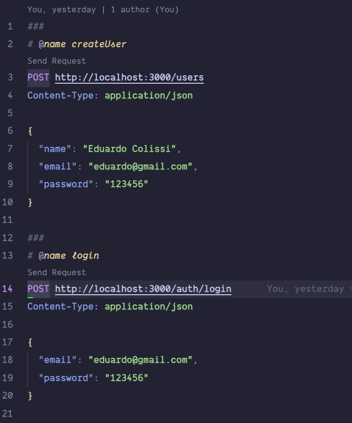
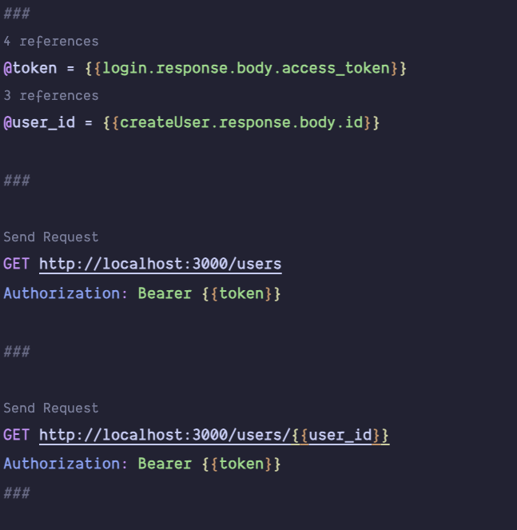
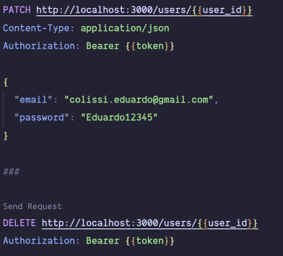

# NestJS Clean API

This project is developed as a learning exercise to explore the NestJS framework and its integration with Clean Architecture principles, SOLID design concepts, and TypeScript. The primary focus is to build a modular and scalable application by adhering to industry best practices and architectural patterns.

# IMPORTANT!!!

I chose to use SQLite in memory cache because this project is for studying the framework itself, not for database management. Therefore, remember that there is no need for environment variable configuration (including the JWT generation key, which is hard-coded; I know this is not a best practice for production projects, but the goal was to make it easier for anyone testing). Ideally, these settings should be in a .env file. However, be aware that every time the API undergoes an update or refresh, you will "lose the data." This happens because I used SQLite in memory to avoid database configuration for anyone testing the project.

## Tech Stack

**Server:** NestJS, Typescript, JWT, TypeORM

**Tests:** Jest

## Features

- Users CRUD
- Auth with JWT
- Unit Tests
- SOLID principles
- Clean Architecture

## Run Locally

Clone the project

```bash
  git clone https://github.com/EduardoColissi/nest-clean-arch-api.git
```

Go to the project directory

```bash
  cd nest-clean-arch-api
```

Install dependencies

```bash
npm install
```

Start the server

```bash
npm run start:dev
```

To run tests

```bash
npm run test
```

## Testing Endpoints

I added an `api.http` file in the root of the project, so if you want to test the requests without using Insomnia or Postman, just download the REST Client extension for VSCode. With the HTTP file, you will be able to test the requests easily.





### Developed by Eduardo Colissi
